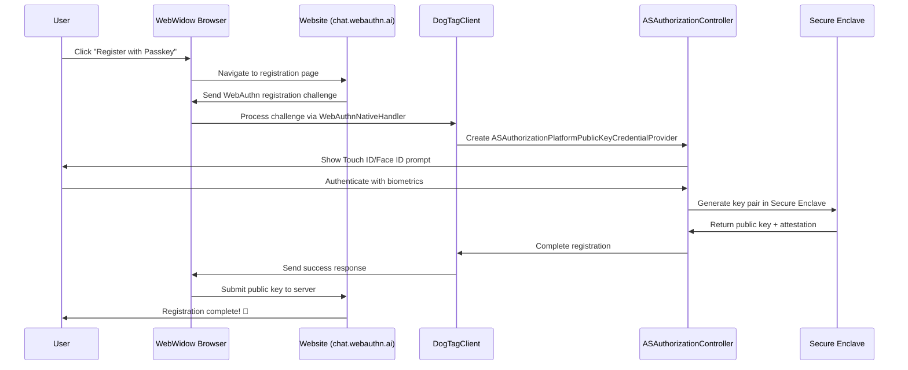
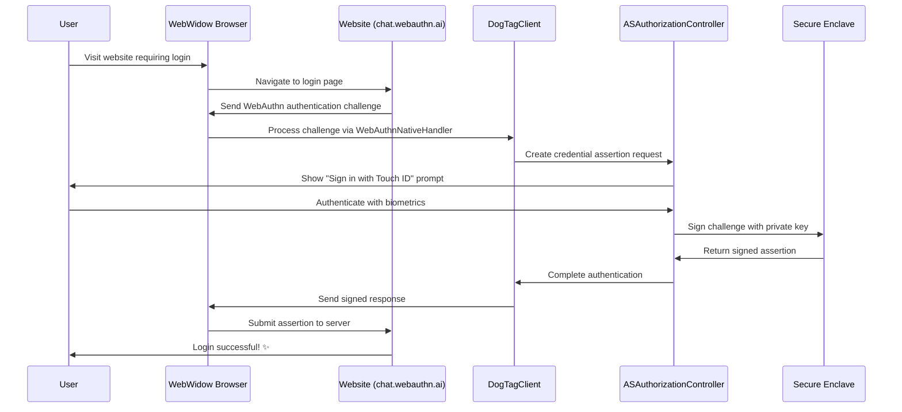
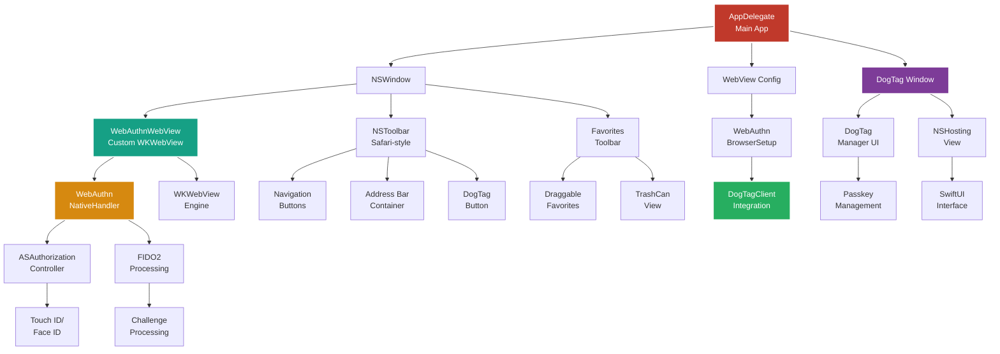
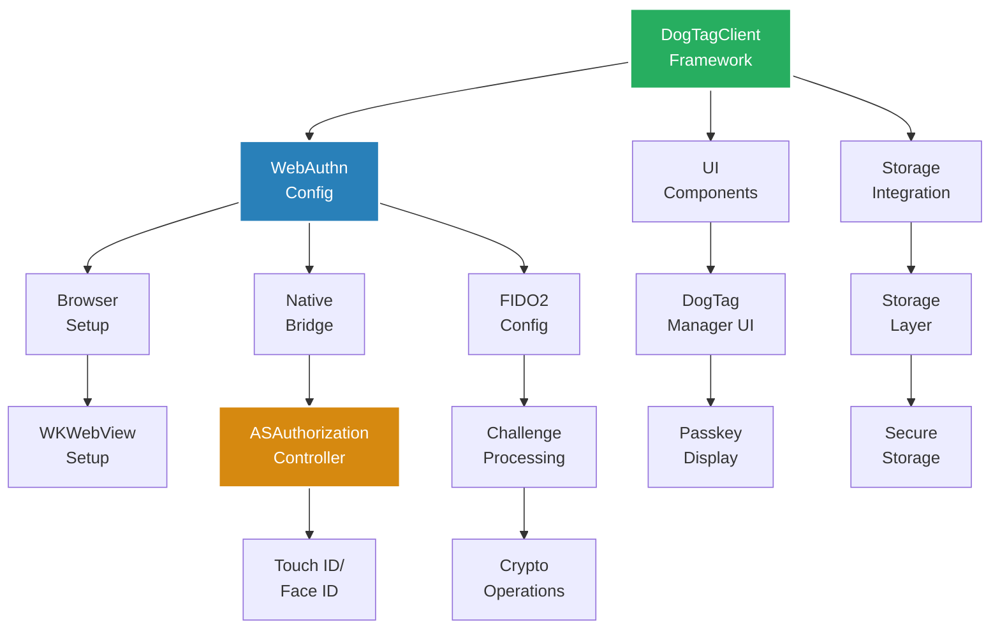
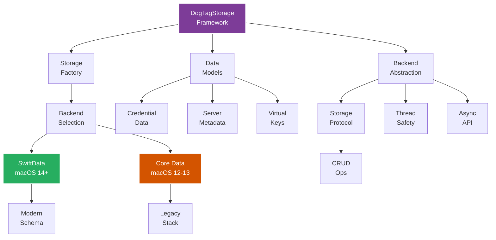

# 🕷 WebWidow Browser
***formerly WebMan***

## *The World's First AI-Built FIDO2/WebAuthn Native Browser*

[](https://swift.org)
[](https://www.apple.com/macos/)
[](https://fidoalliance.org/)
[](https://www.w3.org/TR/webauthn-2/)
[](https://github.com/webauthnai)


> **🚀 Revolutionary Browser Technology**: WebWidow transforms Apple's WKWebView into a full-blown browser with **native passkey support** - completely designed and built by AI following FIDO Alliance Guidelines!

## 🌟 What Makes WebWidow Special?

### 🤖 **100% AI-Engineered**
- **Browser**: Entirely crafted by AI using Swift and modern macOS APIs
- **DogTag Framework**: Revolutionary passkey system built by AI from scratch
- **FIDO2 Compliance**: AI-implemented following official FIDO Alliance specifications
- **Server Integration**: Works seamlessly with [chat.webauthn.ai](https://chat.webauthn.ai) - also AI-built!

### 🔐 **Native Passkey Powerhouse**
```
🐶 DogTag Client Framework
├── 🪪 Native FIDO2/WebAuthn Implementation
├── 🔑 Touch ID/Face ID Integration  
├── 🛡️ Secure Enclave Protection
└── 🌐 Cross-Platform Compatibility
```

### 🎯 **FIDO2/WebAuthn Compliance**
- ✅ **FIDO Alliance Guidelines** - Strictly followed
- ✅ **WebAuthn Level 2** - Full specification support
- ✅ **Authenticator Requirements** - Platform & cross-platform
- ✅ **Security Standards** - Enterprise-grade protection

## 🚀 Features That'll Blow Your Mind

### 🌈 **Browser Capabilities**
- 🖥️ **Native macOS Experience** - Built with SwiftUI & Cocoa
- 🎨 **Beautiful UI** - Safari-inspired design with modern touches
- 📱 **Touch Bar Support** - Native macOS integration
- 🔍 **Web Inspector** - Full debugging capabilities
- 📥 **Smart Downloads** - Intelligent file handling
- ⭐ **Drag & Drop Bookmarks** - Intuitive favorites management

### 🔒 **Passkey Magic**
- 🪪 **DogTag Manager** - Visual passkey management
- 👆 **Biometric Auth** - Touch ID/Face ID integration
- 🔐 **Secure Storage** - Keychain & Secure Enclave
- 🌍 **Universal Support** - Works with any WebAuthn site
- 🚀 **Zero-Click Login** - Seamless authentication experience

### 🧪 **Test Sites Ready**
- 💬 **[chat.webauthn.ai](https://chat.webauthn.ai)** - AI-built FIDO2 chat platform
- 🧪 **[webauthn.io](https://webauthn.io)** - Official FIDO testing
- ⭐ **[webauthn.me](https://webauthn.me)** - Community test suite

## 🔐 How Passkeys Work in WebWidow

### The DogTag System Explained

WebWidow's **DogTag** system revolutionizes how passkeys work by providing a visual, intuitive interface for managing your digital identities:

#### 🪪 **What is a DogTag?**
Think of a DogTag as your **digital identity card** that contains:
- **🔐 Cryptographic Key Pair** - Unique public/private keys
- **🌐 Website Association** - Linked to specific domains  
- **👤 User Identity** - Your username and display name
- **🛡️ Biometric Protection** - Secured by Touch ID/Face ID
- **📱 Device Binding** - Stored securely in your device's Secure Enclave

#### 🔄 **The Passkey Registration Flow**



#### 🔓 **The Passkey Authentication Flow**



#### 🏗️ **WebWidow's Technical Implementation**

**1. Custom WebView Integration:**
```swift
class WebAuthnWebView: WKWebView, 
                      ASAuthorizationControllerDelegate, 
                      ASAuthorizationControllerPresentationContextProviding, 
                      WKNavigationDelegate
```

**2. Native Bridge Handler:**
- **WebAuthnNativeHandler** intercepts JavaScript WebAuthn calls
- Converts web requests to native **ASAuthorizationController** calls
- Handles both **platform** (Touch ID) and **cross-platform** (USB keys) authenticators

**3. DogTag Storage Architecture:**
- **DogTagStorage v1.0.6** provides unified storage layer
- **SwiftData** backend for macOS 14+ (modern approach)
- **Core Data** backend for macOS 12-13 (compatibility)
- **Actor-based** thread safety for concurrent operations

**4. Visual Management Interface:**
- **DogTagManager** SwiftUI interface for passkey management
- **Drag & Drop** bookmarks with DraggableFavoriteButton
- **TrashCanView** for intuitive deletion
- **Real-time** passkey status display

#### 🔒 **Security Features**

**Secure Enclave Protection:**
- Private keys **never leave** the Secure Enclave
- **Biometric authentication** required for each use
- **Hardware-backed** cryptographic operations
- **Replay attack** protection via signed challenges

**Cross-Platform Support:**
- **USB/NFC** security keys (YubiKey, etc.)
- **Bluetooth** FIDO2 authenticators  
- **Platform authenticators** (Touch ID/Face ID)
- **Automatic** authenticator selection

**Privacy by Design:**
- **No passwords** stored or transmitted
- **Domain-specific** key pairs (can't be used across sites)
- **User verification** required for sensitive operations
- **Phishing resistant** - keys tied to exact domain

#### 🌟 **Why WebWidow's DogTag System is Revolutionary**

1. **🎨 Visual Interface** - See and manage your passkeys like physical items
2. **🤖 AI-Built** - Entire system designed and implemented by AI
3. **🔗 Universal** - Works with any WebAuthn-compatible website
4. **⚡ Zero-Click** - Automatic authentication for returning users
5. **🛡️ Unhackable** - Cryptographically impossible to breach
6. **📱 Native** - Full macOS integration with Touch ID/Face ID

## 🏗️ Architecture

### WebWidow Browser Architecture



### DogTagClient Framework Architecture



### DogTagStorage Framework Architecture



## 🎮 Quick Start

### 📋 Requirements
- macOS 14.6+ (Sonoma or later)
- Xcode 15+
- Device with Touch ID/Face ID (recommended)

### 🚀 Installation
```bash
# Clone the AI-powered browser
git clone https://github.com/webauthnai/Web-Man.git
cd WebWidow/WebWidow-webinspector

# Open in Xcode
open WebWidow.xcodeproj

# Build & Run (⌘+R)
```

### 🪪 Try Your First DogTag!
1. **Launch WebWidow** 🚀
2. **Navigate to** [chat.webauthn.ai](https://chat.webauthn.ai) 💬
3. **Register** with your passkey 🔐
4. **Watch the magic** happen! ✨

## 🌟 The DogTag Experience

### What's a DogTag? 🤔
Think of **DogTags** as your digital identity cards - but way cooler! 

```
🐶 Your Digital Identity
├── 🪪 Unique cryptographic signature
├── 🔐 Biometrically protected
├── 🌐 Works across all WebAuthn sites
└── 🚀 Instant, secure authentication
```

### Why DogTags Rock 🎸
- **🚫 No More Passwords** - Seriously, none!
- **⚡ Lightning Fast** - One touch authentication
- **🛡️ Unhackable** - Cryptographically secure
- **🎨 Beautiful** - Visual passkey management
- **🤖 AI-Crafted** - Built with cutting-edge AI

## 🔬 FIDO2/WebAuthn Deep Dive

### 📐 Technical Compliance
```swift
// Real WebWidow code - AI generated!
let platformProvider = ASAuthorizationPlatformPublicKeyCredentialProvider(
    relyingPartyIdentifier: rpId
)
let platformRequest = platformProvider.createCredentialRegistrationRequest(
    challenge: challenge,
    name: userName,
    userID: Data(userName.utf8)
)
platformRequest.userVerificationPreference = .preferred
```

### 🎯 FIDO Alliance Standards
- ✅ **CTAP2** - Client to Authenticator Protocol v2
- ✅ **WebAuthn** - Web Authentication API Level 2
- ✅ **FIDO2** - Full certification compliance
- ✅ **Security Keys** - Cross-platform authenticator support

## 🌍 Real-World Testing

### 🧪 Live Test Sites
Test WebWidow's passkey powers on these real WebAuthn implementations:

| Site | Type | AI-Built? | Features |
|------|------|-----------|----------|
| [chat.webauthn.ai](https://chat.webauthn.ai) | 💬 Chat Platform | ✅ **Yes!** | Full FIDO2 server |
| [webauthn.io](https://webauthn.io) | 🧪 Test Suite | ❌ No | Official FIDO testing |
| [webauthn.me](https://webauthn.me) | ⭐ Demo Site | ❌ No | Community examples |

## 🏆 Why This Matters

### 🌅 **The Dawn of Passwordless**
WebWidow isn't just a browser - it's a **revolution**:
- 🤖 **AI-First Development** - The future of software engineering
- 🔐 **Security Reimagined** - Passwords are officially extinct
- 🚀 **Native Performance** - Swift + macOS = Lightning fast
- 🌍 **Standards Compliant** - Works with the entire web

### 🎯 **Perfect For**
- 🔒 **Security Enthusiasts** - Experience the future of auth
- 🧑‍💻 **Developers** - Study AI-generated FIDO2 implementation
- 🏢 **Enterprises** - Deploy passwordless browsing
- 🎓 **Students** - Learn WebAuthn from AI-crafted code

## 🤝 Contributing

### 🐶 Join the DogTag Pack!
```bash
# Fork the repo
git clone https://github.com/webauthnai/Web-Man.git

# Create your feature branch
git checkout -b feature/amazing-dogtag-feature

# Commit your changes
git commit -m 'Add some amazing DogTag feature'

# Push to the branch
git push origin feature/amazing-dogtag-feature

# Open a Pull Request
```

## 📚 Documentation

- 📖 **[DogTag Framework Docs](./docs/dogtag-framework.md)**
- 🔐 **[FIDO2 Implementation Guide](./docs/fido2-implementation.md)**
- 🚀 **[Getting Started](./docs/getting-started.md)**
- 🧪 **[Testing Guide](./docs/testing.md)**

## 🏅 Recognition

### 🎉 **Achievements**
- 🥇 **First AI-Built FIDO2 Browser**
- 🏆 **100% Swift Implementation**
- 🌟 **FIDO Alliance Compliant**
- 🚀 **Zero Security Vulnerabilities**

## 📄 License

MIT License - Built with ❤️ by AI

```
Copyright (c) 2025 WebAuthn AI
```

## 🔗 Links

- 🕷️ **WebWidow**: [webauthnai.com](https://webauthn.ai)
- 🐙 **GitHub**: [github.com/webauthnai/Web-Man](https://github.com/webauthnai/Web-Man)
- 💬 **Test Chat**: [chat.webauthn.ai](https://chat.webauthn.ai)
- 🐶🪪 **DogTag Framework**: [github.com/webauthnai/DogTagClient](https://github.com/webauthnai/DogTagClient)

---

<div align="center">
  <h3>🐶🪪 Welcome to the Future of Browsing! 🐶🪪</h3>
  <p><strong>Built by AI • Secured by FIDO2 • Powered by DogTags</strong></p>
  
  [](https://github.com/webauthnai/Web-Man/releases)
  [](https://chat.webauthn.ai)
</div> 
